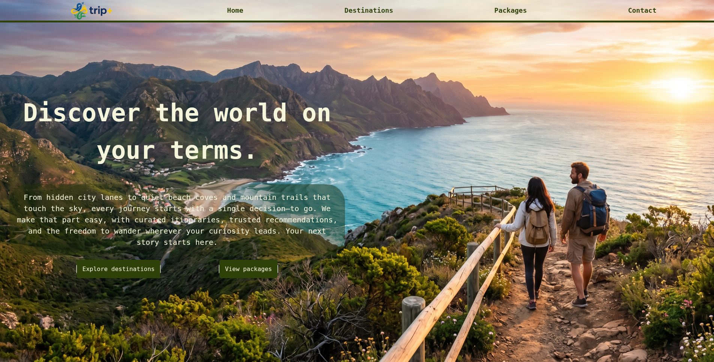
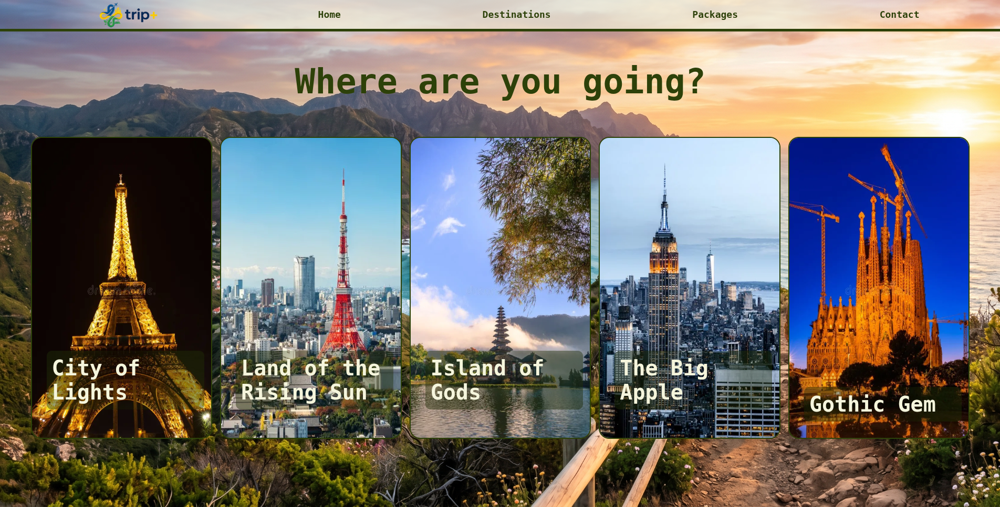
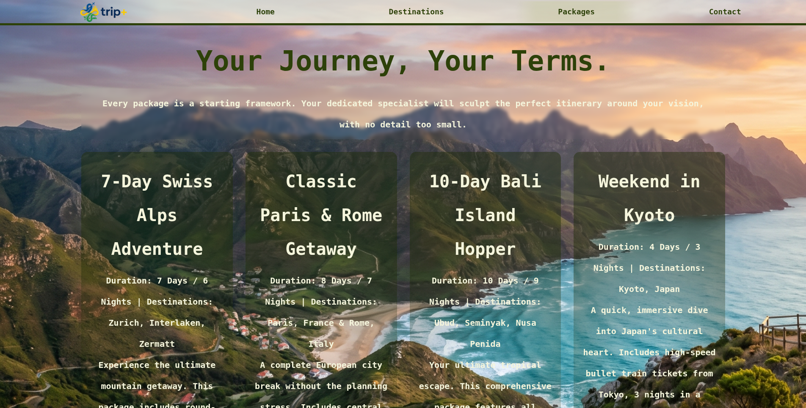
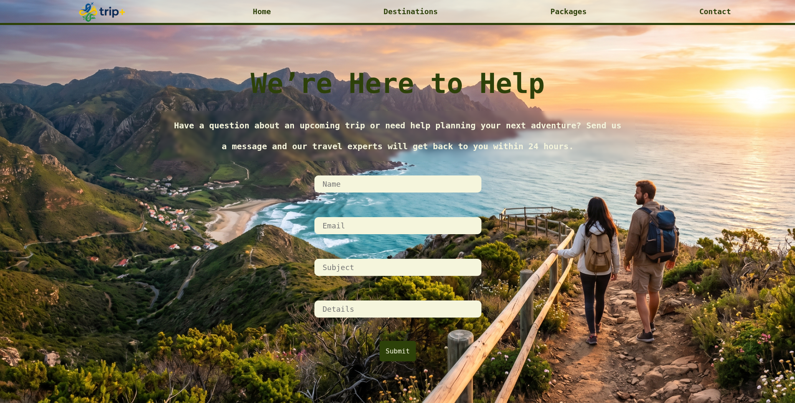

# TripPlus

A travel website built with Node.js, Express, and EJS that allows users to explore destinations, browse travel packages, and view destination-specific information through dynamic routing.

## Features

- Destination exploration
- Travel package listings
- Dynamic destination pages
- Contact page
- Responsive interface
- Server-side rendering with EJS

## Tech Stack

<p>
  
  
  
  
  
</p>

## Project Structure

```text
TripPlus/
├── pages/
├── public/
├── views/
├── app.js
├── package.json
└── README.md
```

## Running Locally

```bash
git clone <repository-url>

cd TripPlus

npm install

node app.js
```

Open:

```text
http://localhost:5000
```

## Running Tests

No automated tests are configured for this project.

## Integration Notes

The application can be expanded with booking systems, authentication, payment gateways, and database-backed travel management features.

## Visuals

### Home Page



### Destinations



### Destinatiom


### Packages



### Contact



## Additional Resources

- Express Documentation: https://expressjs.com/
- EJS Documentation: https://ejs.co/
